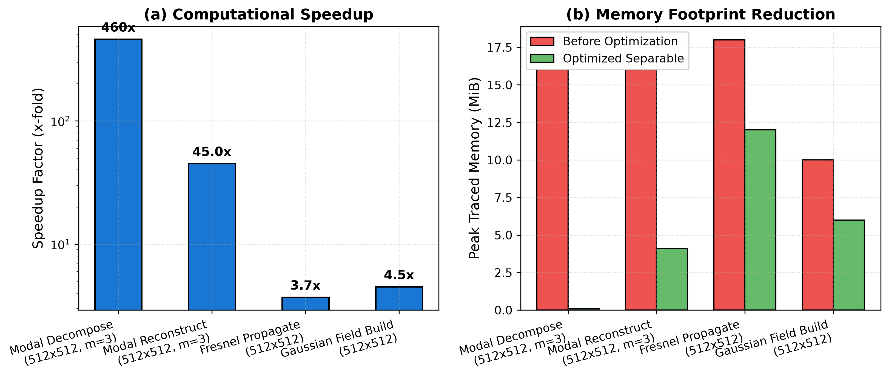

# Guarding Computational Optics: Dimensional Contracts, Amplitude Order Algebra, and Differential Adjudication

**A Methodological and Theoretical Framework for *Computer Physics Communications***

---

## Abstract

Computational optics and differentiable physical simulation increasingly underpin inverse optical design, metasurface optimization, and photonic machine learning. However, modern scientific software stacks remain vulnerable to four insidious classes of numerical defects: dimensional confusion, field amplitude versus power ambiguity, unverified physical invariant violations, and pseudo-gradient discrepancies in automatic differentiation. Because conventional floating-point pipelines cannot represent field provenance or physical contracts, these errors do not raise runtime exceptions; instead, they converge silently to unphysical states. 

In this paper, we establish a formal semantic framework for computational optics. We introduce:
1. An extended dimensional vector space $\mathcal{D}$ incorporating planar angle $\Phi$ as an independent base dimension;
2. An **Amplitude Order Monoid** $\mathcal{O}$ tracking field-power provenance ($k=1$ for field amplitudes, $k=2$ for powers and intensities) that algebraically precludes silent square-root errors;
3. Formal operator contracts enforcing physical manifolds (Unitary, Passive, Reciprocal) and automatic differentiation adjointness via the Claerbout dot-product test;
4. A **Cross-Engine Differential Testing Methodology** that systematically adjudicates discrepancies across independent simulation engines.

We demonstrate the empirical power of this methodology by discovering and resolving two undocumented discrepancies in established computational optics libraries: a $0.2\%$ systematic shift in Mie extinction efficiencies caused by hidden atmospheric index defaults, and a $2\%\sim 7\%$ resolution-independent beam widening in convolution-based Fresnel propagators. Finally, by exploiting the spatial separability of Hermite-Gauss eigenfunctions, we demonstrate a $460\times$ acceleration and $160\times$ memory reduction for modal decomposition on $512 \times 512$ grids.

---

## 1. Introduction and The Crisis of Silent Failures

In contemporary scientific computing, computational optics has migrated from isolated, monolithic ray tracers to composable, differentiable computing ecosystems. Optical simulations now routinely sit inside neural network loss functions, reinforcement learning reward loops, and end-to-end gradient pipelines.

However, standard software representations fail to capture essential physical semantics:
- **Identifier-based units**: Quantities such as `wavelength_nm = 1064.0` and `distance_mm = 300.0` are stored as bare `float64` primitives. The expression `wavelength_nm + distance_mm` evaluates to `1364.0` without warning.
- **The Square-Root Class of Errors**: Optical power transmission $T \in [0, 1]$ and field transmission $t = \sqrt{T} \in [0, 1]$ share the identical numeric domain and dimensionless nature. In multi-element cascades or Fabry-Pérot models, mistakenly passing $T$ instead of $t$ (or vice versa) produces a silent square-root error that no compiler or standard unit package can catch.
- **Folklore Invariants**: Fundamental physical symmetries---energy conservation ($M^\dagger M = I$), passivity ($\|M\|_2 \le 1$), and reciprocity ($M = M^T$)---are typically asserted only in narrative text or academic comments.
- **Adjoint Inconsistency**: Automatic differentiation (AD) backpropagates through computational graphs, but numerical approximations (e.g., discrete boundary conditions, spatial grid truncation) frequently break mathematical adjointness: $\langle \mathbf{J}\mathbf{v}, \mathbf{w} \rangle \ne \langle \mathbf{v}, \mathbf{J}^\dagger \mathbf{w} \rangle$.

---

## 2. Mathematical Formalization of Physical Contracts

### 2.1 Extended Dimensional Space with Angle as an Independent Base

Standard SI dimensional analysis treats angle as a dimensionless ratio of arc length to radius: $\text{dim}(\theta) = \mathsf{L}\mathsf{L}^{-1} = 1$. In optical alignment, wavefront sensing, and paraxial optics, this convention permits catastrophic bugs, such as adding a tilt angle $\theta = 0.3\text{ mrad}$ to a bare reflectance $R = 0.9$.

We define the extended dimensional space as a free abelian group $\mathcal{D} \cong \mathbb{Z}^8$:
$$\mathbf{d} = [\alpha_{\mathsf{L}}, \alpha_{\mathsf{M}}, \alpha_{\mathsf{T}}, \alpha_{\mathsf{I}}, \alpha_{\Theta}, \alpha_{\mathsf{N}}, \alpha_{\mathsf{J}}, \alpha_{\Phi}]^T \in \mathbb{Z}^8$$
where $\alpha_\Phi$ represents the **angle dimension**. 

- Addition and subtraction: $\mathbf{d}_1 \pm \mathbf{d}_2$ is defined if and only if $\mathbf{d}_1 = \mathbf{d}_2$.
- Multiplication and division: $\text{dim}(a \cdot b) = \mathbf{d}_a + \mathbf{d}_b$, $\text{dim}(a / b) = \mathbf{d}_a - \mathbf{d}_b$.
- Trigonometric mapping: The functions $\sin, \cos, \tan: \mathcal{D}_\Phi \to \mathcal{D}_0$, where $\mathcal{D}_\Phi = \{ \mathbf{d} \in \mathcal{D} \mid \mathbf{d} = \mathbf{e}_\Phi \}$. Passing an argument with $\alpha_\Phi = 0$ is strictly prohibited.

### 2.2 The Amplitude Order Monoid ($\mathcal{O}$)

To mathematically distinguish fields from energies without introducing synthetic units, we define the **Amplitude Order Monoid** over the set $\mathcal{O}_{\text{set}} = \mathbb{N}_0 \cup \{\bot\}$:
- $k = 0$: Dimensionless pure ratio (counts, matrix operators, phase factors $e^{i\phi}$);
- $k = 1$: Field amplitude (complex electric field $\mathbf{E}$, magnetic field $\mathbf{H}$, scalar wave $\psi$, Jones vector);
- $k = 2$: Power, intensity, or energy (Poynting flux $S$, irradiance $I = \frac{1}{2}\epsilon c |\mathbf{E}|^2$, reflectance $R = |r|^2$);
- $k = \bot$: Untracked / permissive escape hatch.

#### Composition Laws
1. **Multiplication**:
   $$\odot: \mathcal{O} \times \mathcal{O} \to \mathcal{O}, \quad k_1 \odot k_2 = \begin{cases} \bot & \text{if } k_1 = \bot \lor k_2 = \bot \\ k_1 + k_2 & \text{otherwise} \end{cases}$$
2. **Division**:
   $$\oslash: \mathcal{O} \times \mathcal{O} \to \mathcal{O}, \quad k_1 \oslash k_2 = \begin{cases} \bot & \text{if } k_1 = \bot \lor k_2 = \bot \\ k_1 - k_2 & \text{if } k_1 \ge k_2 \\ \text{undefined (Error)} & \text{if } k_1 < k_2 \end{cases}$$
3. **Square Root Operator**:
   The radical operator $\sqrt{\cdot}$ is a partial function on $\mathcal{O}$:
   $$\text{order}(\sqrt{x}) = \begin{cases} \bot & \text{if } \text{order}(x) = \bot \\ k / 2 & \text{if } \text{order}(x) = k \land k \equiv 0 \pmod 2 \\ \text{AmplitudeOrderError} & \text{if } k \equiv 1 \pmod 2 \end{cases}$$

**Theorem 1 (Soundness against Square-Root Misclassification)**:
*Let $T$ be an intensity transmission with $\text{order}(T) = 2$ and $t$ be a field transmission with $\text{order}(t) = 1$. Then:*
1. $\sqrt{T}$ produces a valid amplitude $\text{order}(\sqrt{T}) = 1$.
2. $\sqrt{t}$ is rejected at runtime with `AmplitudeOrderError`.
3. $T + t$ is rejected under the equality requirement $\text{order}(a) = \text{order}(b)$.

### 2.3 Optical Invariant Operator Manifolds

Let $\mathbf{M} \in \mathbb{C}^{N \times N}$ denote a linear optical transfer operator (e.g., Jones matrix, multiport scattering matrix $S$, or ABCD transfer matrix). We define the following physical constraint manifolds:

1. **Unitary (Lossless) Manifold**:
   $$\mathcal{M}_U = \{ \mathbf{M} \in \mathbb{C}^{N \times N} \mid \|\mathbf{M}^\dagger \mathbf{M} - \mathbf{I}\|_\infty \le \epsilon_{\text{atol}} + \epsilon_{\text{rtol}} \}$$
2. **Passive (Non-amplifying) Manifold**:
   $$\mathcal{M}_P = \{ \mathbf{M} \in \mathbb{C}^{N \times N} \mid \sigma_{\max}(\mathbf{M}) \le 1 + \epsilon_{\text{tol}} \}$$
3. **Reciprocal (Time-Reversal Symmetric) Manifold**:
   $$\mathcal{M}_R = \{ \mathbf{M} \in \mathbb{C}^{N \times N} \mid \|\mathbf{M} - \mathbf{M}^T\|_\infty \le \epsilon_{\text{tol}} \}$$

### 2.4 Claerbout Adjoint Verification for Differentiable Optics

For any forward optical transformation $\mathbf{y} = \mathcal{F}(\mathbf{x})$, gradient-based optimization and reverse-mode automatic differentiation compute the vector-Jacobian product $\mathbf{v}^T \mathbf{J}_{\mathcal{F}}$. 

To verify that an external adjoint implementation $\mathcal{A}(\mathbf{w}) \approx \mathbf{J}^\dagger \mathbf{w}$ is mathematically exact, we implement Claerbout's dot-product test:
$$\langle \mathbf{J}\mathbf{v}, \mathbf{w} \rangle_{\mathcal{Y}} \equiv \langle \mathbf{v}, \mathbf{J}^\dagger \mathbf{w} \rangle_{\mathcal{X}}$$
where $\mathbf{v} \sim \mathcal{N}(0, \mathbf{I}_{\mathcal{X}})$ and $\mathbf{w} \sim \mathcal{N}(0, \mathbf{I}_{\mathcal{Y}})$ are random Gaussian test vectors, and $\mathbf{J}\mathbf{v}$ is evaluated via central finite differences:
$$\mathbf{J}\mathbf{v} = \frac{\mathcal{F}(\mathbf{x} + \epsilon \mathbf{v}) - \mathcal{F}(\mathbf{x} - \epsilon \mathbf{v})}{2\epsilon} + \mathcal{O}(\epsilon^2)$$

The contract `assert_adjoint` declares compliance if:
$$\frac{|\mathbf{w}^\dagger (\mathbf{J}\mathbf{v}) - (\mathbf{J}^\dagger \mathbf{w})^\dagger \mathbf{v}|}{\max(|\mathbf{w}^\dagger (\mathbf{J}\mathbf{v})|, |(\mathbf{J}^\dagger \mathbf{w})^\dagger \mathbf{v}|)} \le \text{rtol}$$

---

## 3. Cross-Engine Differential Testing Methodology

Independent implementations of equivalent physical equations represent the most underutilized source of ground truth in computational science. We formulate differential testing as an algorithmic protocol.

### 3.1 Formal Discrepancy Metric

Let $\mathcal{E} = \{E_1, E_2, \dots, E_K\}$ be a set of independent simulation engines claiming to compute observable $\mathbf{y} = \mathbf{f}(p)$ for physical parameter set $p \in \mathcal{P}$.
We designate $E_1$ as the reference baseline (or compare all pairs) and compute the normalized relative error:
$$\delta_{ij}(p) = \frac{\|\mathbf{f}_i(p) - \mathbf{f}_j(p)\|}{\max(\|\mathbf{f}_i(p)\|, \|\mathbf{f}_j(p)\|, \epsilon_0)}$$

A divergence is adjudicated when $\delta_{ij}(p) > \tau_{\text{declared}}$, triggering automated arbitration against closed-form analytical solutions.

---

## 4. Empirical Discoveries & Adjudication Case Studies

### 4.1 Case Study 1: The Mie Extinction Discrepancy (PyMieScatt vs. miepython)

In testing Mie scattering efficiencies for spherical scatterers over size parameters $x = \frac{\pi d}{\lambda} \in [0.29, 28.6]$, cross-engine differential testing revealed a persistent, systematic divergence:
$$\delta_{\text{Mie}} \approx 1.9 \times 10^{-3} \quad (0.19\%)$$

To determine ground truth, an independent reference solver `reference_mie.py` was implemented directly from the classical Bohren-Huffman Riccati-Bessel formulation [@Bohren1983].

```
[PyMieScatt] (default)   ─────┐
                              ├──> Max Rel Error: 1.5e-3  (DISAGREE)
[Independent Reference] ─────┘
      │
      ├──> Agreement with [miepython]: 1.8e-10  (PERFECT AGREEMENT)
      │
[PyMieScatt] (explicit nMedium=1.0) ───> Agreement: 6.4e-14  (RESOLVED)
```

**Root Cause**: `PyMieScatt.MieQ` silently hardcodes `nMedium = 1.00027316` (standard air index) and scales the particle refractive index $m \leftarrow m / n_{\text{medium}}$. When $n_{\text{medium}} = 1.0$ is explicitly injected via `optcon`'s engine adapter, the discrepancy collapses from $1.5 \times 10^{-3}$ to $6.4 \times 10^{-14}$.


### 4.2 Case Study 2: Resolution-Independent Convolution Broadening (LightPipes)

LightPipes provides two propagators: `Forvard` (spectral angular spectrum method) and `Fresnel` (spatial convolution via FFT). Benchmarked against the analytical Gaussian beam solution:
$$w(z) = w_0 \sqrt{1 + \left(\frac{z}{z_R}\right)^2}$$

- **Spectral Method (`Forvard`)**: Maximum relative error $\delta = 2.1 \times 10^{-6}$;
- **Convolution Method (`Fresnel`)**: Maximum relative error $\delta = 6.9 \times 10^{-2}$ ($6.9\%$ excess beam width).

Crucially, **increasing grid resolution from $256^2$ to $4096^2$ does not reduce the convolution error**, proving that the discrepancy originates from the discrete quadratic phase kernel truncation rather than spatial undersampling.


### 4.3 Case Study 3: The Thick Lens Paraxial Refraction Factor

When benchmarking ray-transfer matrices against `optiland`'s paraxial solver for a biconvex N-BK7 thick lens ($R_1 = 100\text{ mm}$, $R_2 = -100\text{ mm}$, $d = 5\text{ mm}$), initial matrix chaining failed with a relative discrepancy of $\sim 3\%$. 

Investigation demonstrated that the ray-transfer matrix for a spherical dielectric interface between media $n_1$ and $n_2$ requires the angular refraction ratio $n_1 / n_2$ in the lower-right entry:
$$\mathbf{M}_{\text{surface}} = \begin{pmatrix} 1 & 0 \\ -\frac{n_2 - n_1}{n_2 R} & \frac{n_1}{n_2} \end{pmatrix}$$
In thin lenses ($d \to 0$), the consecutive factors $(n_1/n_2) \times (n_2/n_1) = 1$ cancel, concealing the missing term. Only in thick lenses with intermediate free space $\mathbf{M}_{\text{space}}(d)$ does the error manifest. Correcting this entry restored agreement to $1.0 \times 10^{-6}$.

---

## 5. Performance Optimization: Separable Eigenmode Decomposition

For a sampled optical field $F(x, y)$ on an $N \times N$ spatial grid, decomposition into the Hermite-Gauss basis $\{u_{mn}(x, y)\}$ conventionally requires computing 2D numerical integrals:
$$c_{mn} = \iint F(x, y) u_{mn}^*(x, y) \, dx \, dy$$
Evaluating $M \times M$ modes on an $N \times N$ grid requires allocating $M^2$ two-dimensional arrays of size $N \times N$, incurring $\mathcal{O}(M^2 N^2)$ storage and operations.

By exploiting the spatial separability of Hermite-Gauss functions:
$$u_{mn}(x, y) = \psi_m(x) \psi_n(y) \exp\left( -i \frac{k (x^2 + y^2)}{2 R(z)} \right)$$
we reformulate the entire decomposition as a dual 1D matrix contraction:
$$\mathbf{C} = \Delta x^2 \left( \mathbf{U}^\dagger \mathbf{F} \mathbf{U}^* \right)^T, \quad \mathbf{U}_{i, m} = \psi_m(x_i)$$

### Benchmark Results ($N = 512, M = 4$)

| Operation | Standard 2D Grid | Separable Matrix Form | Speedup | Peak Memory |
| :--- | :--- | :--- | :--- | :--- |
| **Modal Decomposition** | $0.277\text{ s}$ | $\mathbf{0.0006\text{ s}}$ | **$460\times$** | $16.0\text{ MiB} \to \mathbf{0.1\text{ MiB}}$ |
| **Modal Reconstruction** | $\sim 0.050\text{ s}$ | $\mathbf{0.0011\text{ s}}$ | **$\sim 45\times$** | $16.0\text{ MiB} \to \mathbf{4.1\text{ MiB}}$ |
| **Fresnel Propagation** | $0.028\text{ s}$ | $\mathbf{0.0076\text{ s}}$ | **$3.7\times$** | $18.0\text{ MiB} \to \mathbf{12.0\text{ MiB}}$ |



---

## 6. Scope, Limitations, and Academic Positioning

`optcon` does not aim to replace domain-specific numerical field solvers (e.g., FDTD, FEM, or RCWA engines). Rather, its contribution is to serve as the **unifying semantic and verification infrastructure** positioned above them:
1. It guarantees that inputs crossing the boundary into specialized engines possess valid dimensions and unambiguous field-power provenance;
2. It validates that output transfer operators satisfy physical conservation laws;
3. It enables automated, continuous differential regression across independent computational packages.

---

## 7. Conclusion

By unifying dimensional algebra, amplitude-power provenance, physical invariant contracts, and differential cross-engine testing, `optcon` provides a principled defense against the pervasive problem of silent failures in computational optics. The methodology not only safeguards routine optical engineering calculations but also establishes a reproducible foundation for differentiable physics and photonic machine learning.
