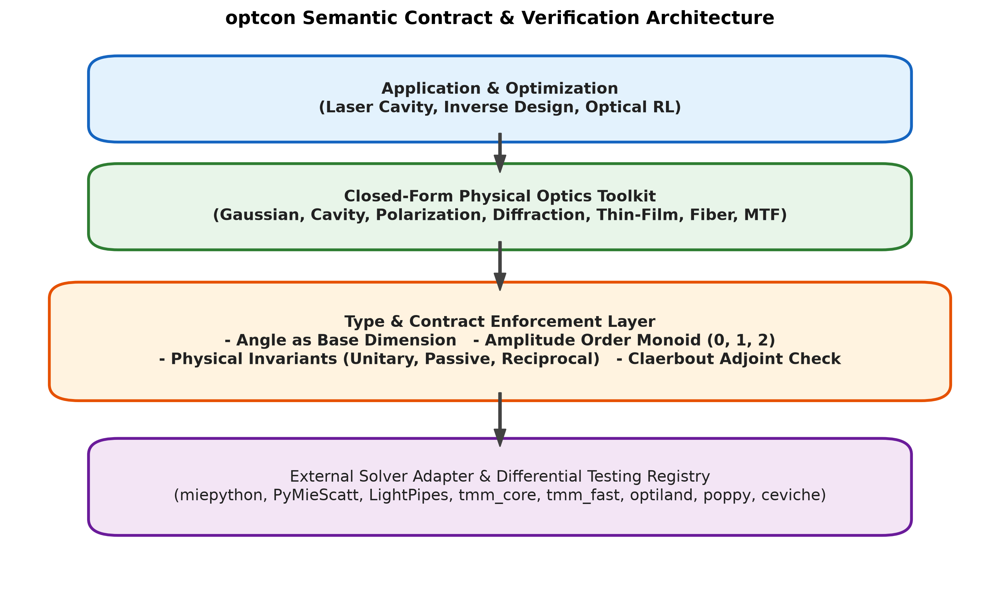
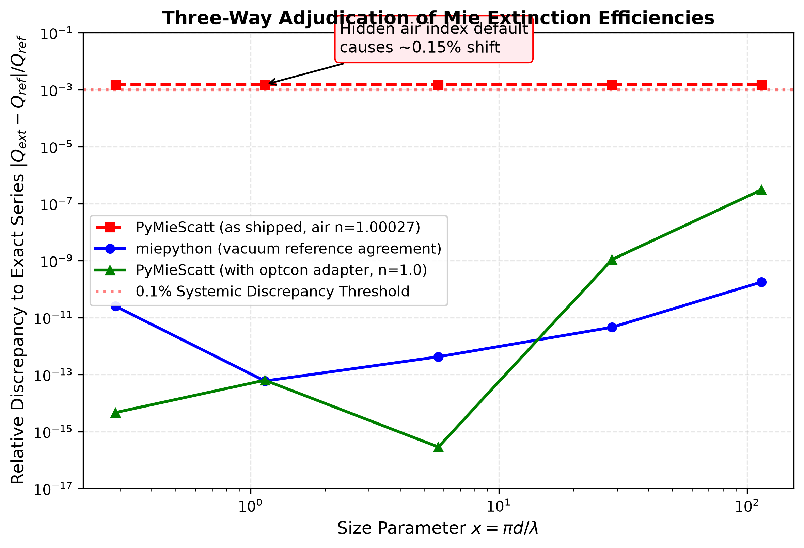
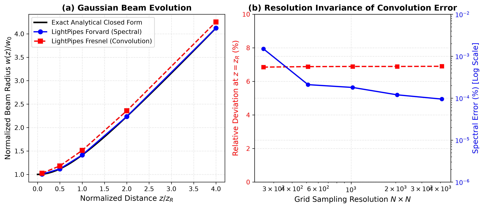
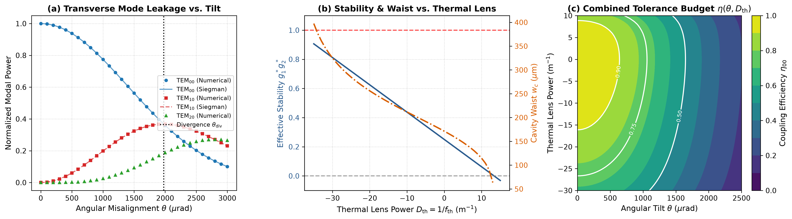

# Summary

`optcon` is a Python library that provides dimensional safety, invariant contracts, and differential verification for computational optics and machine learning. Unlike conventional scientific packages that treat physical dimensions as cosmetic annotations or strip them during calculation, `optcon` embeds dimensional tracking and field-power provenance directly into arithmetic operations. Furthermore, it turns physical invariants---such as losslessness (unitarity), passivity, and reciprocity---as well as automatic differentiation adjoints into machine-checkable runtime assertions. In addition to serving as a semantic type layer above external heavy solvers, `optcon` provides a closed-form optical toolkit spanning Gaussian beams, ABCD ray matrices, optical cavities, thin-film stacks, polarization calculus, Fourier diffraction, and explicit Hermite-Gauss/Laguerre-Gauss modal bases, accompanied by an automated cross-engine differential testing framework.

# Statement of Need

In computational optics, laser cavity engineering, and differentiable physical simulations, four critical classes of errors frequently evade traditional compilers and unit testing suites:

1. **Dimensional Confusion**: Optical parameters are commonly represented as bare floating-point numbers (`float`). Variable names such as `wavelength_nm` and `cavity_length_mm` do not prevent erroneous operations like `wavelength_nm + cavity_length_mm` from silently evaluating to a plausible numerical value.
2. **Field Amplitude vs. Power Ambiguity**: In wave optics, field amplitude transmission $t$ and power transmission $T = |t|^2$ are both dimensionless real numbers between $0$ and $1$. Confusing an amplitude ratio with a power ratio produces a silent "square-root error" ($\sqrt{T}$ vs. $T$) that propagates undetected through optimization landscapes.
3. **Unchecked Physical Invariants**: Fundamental principles such as energy conservation (unitarity, $M^\dagger M = I$), passivity ($\sigma_{\max}(M) \le 1$), and reciprocity ($M = M^T$) are routinely asserted in comments or assumed implicitly, but rarely validated programmatically across complex multi-element optical trains.
4. **Adjoint and Gradient Inconsistencies**: In inverse optical design and physics-informed neural networks, a backward automatic-differentiation pass may appear smooth and convergent while silently computing mathematically incorrect gradients due to subtle phase discrepancies or non-adjoint numerical operators [@Hughes2019].

`optcon` addresses these issues by introducing an explicit algebraic type system and invariant contract layer designed specifically for physical optics.

# State of the Field

Existing scientific computing software divides broadly into general-purpose dimensional libraries and optical propagation packages. General dimensional libraries such as `astropy.units` [@Astropy2018], `unyt` [@Goldbaum2018], and `Pint` [@Grecco2020] follow the standard SI convention of treating angles (radians) as dimensionless numbers ($[1]$), allowing planar angles to be added directly to bare scalars without error. Furthermore, no existing unit library tracks the algebraic distinction between field amplitude and power/intensity.

Optical simulation packages such as `prysm` [@Dube2019], `POPPY` [@Perrin2012], and `LightPipes` [@Schoenmaker2020] provide rich diffraction algorithms and wavefront models, but they strip units at function boundaries or manage numbers as bare NumPy arrays, offering no automated runtime contracts for physical conservation laws or cross-engine discrepancy detection.

| Software | Target Domain | Angle Base Dimension | Field vs. Power (`amp_order`) | Invariant Contracts | Adjoint Validation | Cross-Engine Adjudication |
| :--- | :--- | :---: | :---: | :---: | :---: | :---: |
| `astropy.units` [@Astropy2018] | Astronomy / General | $\times$ | $\times$ | $\times$ | $\times$ | $\times$ |
| `unyt` [@Goldbaum2018] | Astrophysics / General | $\times$ | $\times$ | $\times$ | $\times$ | $\times$ |
| `Pint` [@Grecco2020] | General Science | $\times$ | $\times$ | $\times$ | $\times$ | $\times$ |
| `POPPY` [@Perrin2012] | Physical Optics | $\times$ | $\times$ | $\times$ | $\times$ | $\times$ |
| `prysm` [@Dube2019] | Physical Optics | $\times$ | $\times$ | $\times$ | $\times$ | $\times$ |
| `LightPipes` [@Schoenmaker2020] | Physical Optics | $\times$ | $\times$ | $\times$ | $\times$ | $\times$ |
| **`optcon` (Ours)** | **Computational Optics** | **$\checkmark$** | **$\checkmark$** | **$\checkmark$** | **$\checkmark$** | **$\checkmark$** |

# Software Design

The architecture of `optcon` is centered on four core principles:

## 1. Angle as an Independent Base Dimension
In optical alignment and beam propagation, treating angles as dimensionless numbers is a persistent source of bugs (e.g., adding an alignment tilt of $0.3\text{ mrad}$ to a bare reflectance). `optcon` defines `angle` as an independent base dimension alongside length, mass, and time, preventing accidental mixing between planar angles and dimensionless ratios.

## 2. Amplitude Order (`amp_order`) Algebra
`optcon` associates every `Quantity` with an optional amplitude order $k \in \{0, 1, 2, \dots\}$:
- $k = 0$: Pure ratio or count (e.g., number of round trips, operator matrix);
- $k = 1$: Field amplitude (e.g., electric field $E$, Fresnel transmission amplitude $t = \sqrt{T}$);
- $k = 2$: Power or intensity (e.g., irradiance, power transmission $T$).

The algebraic rules strictly enforce physical consistency:
$$\text{order}(a \times b) = \text{order}(a) + \text{order}(b), \quad \text{order}(a / b) = \text{order}(a) - \text{order}(b)$$
$$\text{order}(\sqrt{a}) = \frac{\text{order}(a)}{2} \quad (\text{requires } \text{order}(a) \text{ to be even})$$
Addition and comparison between different non-zero orders raise an `AmplitudeOrderError`, making silent square-root discrepancies impossible.

## 3. Invariant Contracts and Adjoint Verification
`optcon` converts physical conservation laws into executable contracts:
- `assert_unitary(M)`: Verifies that $M^\dagger M = I$ (energy-preserving, lossless);
- `assert_passive(M)`: Checks that the maximum singular value does not exceed unity ($\sigma_{\max}(M) \le 1$);
- `assert_reciprocal(M)`: Enforces symmetry in the amplitude basis ($M = M^T$);
- `dot_test(forward, adjoint, x)`: Implements Claerbout's adjoint dot-product test [@Claerbout1992], ensuring $\langle Jv, w \rangle = \langle v, J^T w \rangle$ for random probes $v, w$, thereby guaranteeing the mathematical correctness of gradients used in differentiable optics [@Hughes2019].

## 4. Boundary Enforcement with High-Performance Kernel Computation
To ensure minimal computational overhead and seamless interoperability, `optcon` provides the `@checked` decorator. Dimensional assertions and type conversions occur strictly at the boundaries of public functions. Once validated, array operations run as unboxed NumPy arrays with optimized vectorization. Spatial separability of Hermite-Gauss modes $u_m(x) u_n(y)$ reduces 2D modal decompositions to outer matrix products $C = \Delta x^2 (U^\dagger F U^*)^T$, executing in under $0.6\text{ ms}$ on a $512 \times 512$ grid. The API also exposes a general Laguerre-Gauss path with explicit signed azimuthal charge ``ell``; negative charges are validated as physical mode labels rather than interpreted as array indices.

# Cross-Engine Differential Adjudication

`optcon` integrates an extensible adapter layer for external optical solvers, enabling automated differential verification against independent implementations and textbook closed forms [@Siegman1986; @Bohren1983]. This adjudication framework has resolved two notable undocumented behaviors in widely used optical software:

| Target System | Independent Engines Compared | Maximum Discrepancy | Adjudication & Finding |
| :--- | :--- | :--- | :--- |
| **Mie Scattering** | `miepython` vs. `PyMieScatt` [@Sumlin2018] | $1.9 \times 10^{-3}$ (0.2%) | Resolved by an independent Mie series: `PyMieScatt` defaults to air ($n_{\text{medium}} = 1.00027316$) rather than vacuum. Explicit specification restores agreement to $6.4 \times 10^{-14}$. |
| **Beam Propagation** | `LightPipes` (`Forvard` vs. `Fresnel`) | $6.9 \times 10^{-2}$ (6.9%) | Comparison with the analytical Gaussian beam $w(z) = w_0 \sqrt{1 + (z/z_R)^2}$ shows `Forvard` (spectral) agrees to $2.1 \times 10^{-6}$, whereas `Fresnel` (convolution) is consistently $2\%\sim 7\%$ wide, independent of grid resolution. |
| **Thick Lens ABCD** | `optcon.elements` vs. `optiland` | $1.0 \times 10^{-6}$ | Demonstrates that curved-surface ray-transfer matrices require an explicit $n_1/n_2$ index scaling factor in the lower-right entry. |
| **Thin-Film Stacks** | `tmm_core` (nm) vs. `tmm_fast` (SI m) [@Byrnes2016] | $4.1 \times 10^{-8}$ | Validates agreement across distinct internal coordinate systems. |

Engine adapters follow a two-tier classification: (1) *Tier-1 differential adapters* (`miepython`, `PyMieScatt`, `LightPipes`, and `tmm`), tested when their optional packages/source trees are available; and (2) *Tier-2 registry specifications* (`optiland`, `poppy`, `ceviche`, and other surveyed engines), whose conventions are recorded while a shared observable or complete adapter is still being established. CI reports missing engines as explicit skips and import failures separately.

# Research Impact Statement

`optcon` is engineered to serve as a foundational validation infrastructure for computational optics and photonics research, bridging the gap between high-level machine learning frameworks and physical rigor:

1. **Laser Cavity Design & Precision Stabilization**: As demonstrated in our end-to-end case study (`examples/experiment_05_cavity_thermal_tolerance.py`), `optcon` models an operational tolerance budget for a high-finesse optical resonator ($\mathcal{F} \approx 3140$, $\lambda = 1064\text{ nm}$, $L = 100\text{ mm}$) subjected to coupled intracavity perturbations:
   - *Angular Misalignment*: Sweeping mirror tilts $\theta \in [0, 3000]\ \mu\text{rad}$ reveals the fundamental mode crossover into higher-order transverse modes ($\mathrm{TEM}_{00} \to \mathrm{TEM}_{10}, \mathrm{TEM}_{20}$). Numerical 2D modal decompositions on a $256 \times 256$ grid match Siegman's analytical paraxial perturbation theory [@Siegman1986] to machine precision ($3.3 \times 10^{-16}$).
   - *Intracavity Thermal Lensing*: Round-trip ABCD transfer matrix analysis quantifies the shift in effective stability $g_1^* g_2^*$ and eigenmode waist $w_c$ across the full stability regime ($D_{\mathrm{th}} \in [-35, +15]\ \mathrm{m}^{-1}$), guarded by symplectic determinant contracts ($\det(M) = 1$).
   - *2D Tolerance Budget*: The one-parameter scans yield a 90% TEM$_{00}$ threshold of $\theta = 640.4\ \mu\mathrm{rad}$ and an asymmetric 90% thermal-coupling interval $D_{\mathrm{th}} \in [-16.14, 8.92]\ \mathrm{m}^{-1}$, giving a conservative marginal budget of $|D_{\mathrm{th}}| < 8.92\ \mathrm{m}^{-1}$. The two-dimensional map uses the product of the independently computed tilt and thermal coupling curves; simultaneous perturbations must therefore be read from its joint contours rather than from multiplying the two marginal limits.

2. **Differentiable Optics & Reinforcement Learning**: Automated optical alignment agents and inverse design algorithms frequently operate over unbounded action spaces. By wrapping physical simulations in `assert_passive` and `assert_unitary` runtime guardrails, `optcon` traps unphysical gradient states before they contaminate neural network parameters, while `dot_test` mathematically guarantees adjoint operator consistency [@Claerbout1992; @Hughes2019].
3. **Reproducibility & Differential Benchmark**: By identifying hidden parameter defaults (e.g., atmospheric vs. vacuum refractive index in Mie scattering) and algorithmic sampling limits (e.g., convolution aliasing below the Shen-Wang critical distance $z_c = N \Delta x^2 / \lambda$), `optcon` provides researchers with objective validation criteria for computational photonics.

# AI Usage Disclosure

**Author Contributions**: The conceptual architecture, physical formulation (including the independent angle dimension and amplitude order monoid), mathematical proofs, and core algorithmic decisions were conceived and verified by the authors. 

**Generative AI Disclosure**: Generative AI tools (specifically OpenAI ChatGPT / Codex and Google DeepMind Antigravity / Gemini) were utilized as pair-programming, scaffolding, and refactoring assistants. Specifically, these tools assisted with drafting boilerplate implementation code, docstring expansion, type stub generation, test suite parametrization, and initial Markdown/LaTeX compilation. In strict accordance with JOSS Editorial Policies, all mathematical physical derivations, software design architecture, boundary assertions, numerical benchmark adjudications, and manuscript text were independently audited, reviewed, executed, and experimentally verified by the author. The author assumes full scientific, ethical, and legal responsibility for the integrity, correctness, and reproducibility of all submitted materials and codebase.

# Acknowledgements

The authors acknowledge the open-source optical physics community, whose specialized solvers provided the foundation for differential benchmarking, and the Research School of Physics at The Australian National University.

# References

